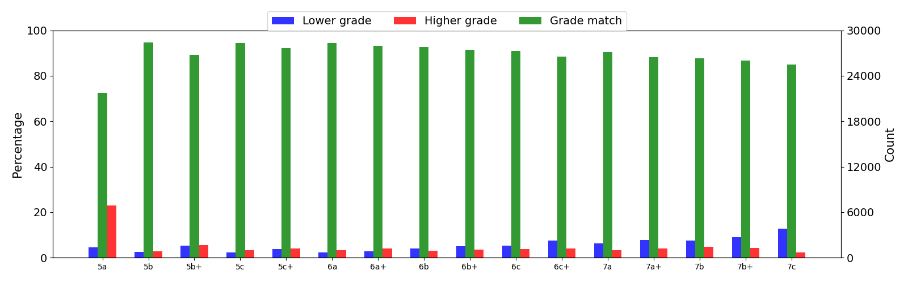
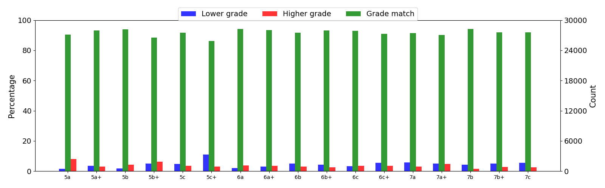

<!------>

## Climbing Route Difficulty Grade Prediction
It is well-known in the climbing community around the world that climbing routes are subjectively graded. A route setter or the climber who first ascended the route typically assigns the difficulty grade that is then shared with the rest of the community. The rater's levels of strenght and skill lead to a personal bias. Another climber, upon attempting the ascent, may find the route more difficulty or easier than officially stated. It is desirable to provide to each climber the route difficulty grade that reflects how this particular climber would perceived the difficulty of the route. 

Results of analysis of climbing ascents are discussed in the paper:
> M.Andric, I.Ivanova, F.Ricci. Climbing Route Difficulty Grade Prediction with Explanation. 2021 IEEE/WIC/ACM International Joint Conference on Web Intelligence and Intelligent Agent Technology (WI-IAT). (to appear)
## Algorithms and Implementation
There are two types of algorithms that were developed to predict the climber's perceived grade of route difficulty: 
> * Knowledge-based regressions models
> * Collaborative filtering 

The perceived grade prediction algorithms are implemented in Python 3.7+.  
## Data
A database of ascents routes was obtained from the Vertical-Life company. Climbers recorded their ascents on indoor and outdoor routes through the [Vertical-Life app](https://www.vertical-life.info/). Each ascent record included the identifier of the climber, the route, the route setter (for indoor ascents), date of ascent and the climber's perceived route difficulty grade. In about 8% of ascent records, the climber's grade is different from the official route grade. About 76% of climbers registered at least once a grade different from the official grade. The sparsity of climber-route matrices are 99.7% and 99.4% for data sets of indoor and outdoor ascents respectively.

## Exploratory Analysis

<!---<table><tr><td></td><td></td></tr></table> --->

## Features
By using domain knowledge we identified a set of features that describe: a) how the target user tends to deviate in grading similar routes and b) how the route is differently evaluated by other climbers. We denote with *g(r)* the official grade of the route *r*, *c* is a climber identifier and *t* is the time point when the prediction has to be computed. We hypothesized that these features are correlated with the perceived grade of a route. 

## Evaluation
We compared the performances of linear regression (linR), random forest regression (randFR) and singular value decomposition (SVD) models to a simple baseline that predicts the official route grade. To this end, we chose a time point for each climber that divides the climber's data in the ratio of 80/20. All models produced lower RMSE errors than the baseline. This is an encouraging result as it shows that our features are able to capture elements that contribute to the correct prediction of the perceived route difficulty grade.

## Future Improvements

<!--## Supplemental Material
Results of analysis of climbing ascents are discussed in the paper:
M.Andric, I.Ivanova, F.Ricci. Climbing Route Difficulty Grade Prediction with Explanation. 2021 IEEE/WIC/ACM International Joint Conference on Web Intelligence and Intelligent Agent Technology (WI-IAT). (to appear)-->

## Credits
Special thanks to Vertical-Life for providing the data and to Ben Lepesant and Andrea Janes for their time and expertise that greatly assisted this work.