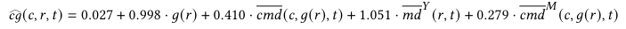
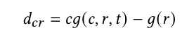
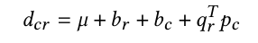

<!------>

<table><tr><td></td><td></td><td></td></tr></table> 

## Climbing Grade Prediction
It is well-known in climbing communities around the world that climbing routes are subjectively graded. A climber who created a route (i.e., route setter) or a climber who first ascended a route typically assign the difficulty grade to the route. The rater's levels of strenght and skill may lead to a personal bias. Thus, another climber upon attempting the ascent may find the route more difficulty or easier than officially stated. From the perspective of a regular climber, when choosing his next ascent it is highly valuable to have a reliable grade that matches his expectation about the ascent difficulty. 

Analysis of climbing ascents is discussed in the paper:
> *M.Andric, I.Ivanova, F.Ricci. **Climbing Route Difficulty Grade Prediction with Explanation**. 2021 IEEE/WIC/ACM International Joint Conference on Web Intelligence and Intelligent Agent Technology (WI-IAT). (to appear)*
## Algorithms and Implementation
Two types of algorithms were developed to predict a climber's perceived grade of the route's difficulty grade: 

* Knowledge-based models.
* Collaborative filtering.

The perceived grade prediction algorithms are implemented in Python 3.7+.   
## Data
A database of ascents routes was obtained from the Vertical-Life company. Climbers recorded their ascents on indoor and outdoor routes through the [Vertical-Life app](https://www.vertical-life.info/). Each ascent record included the identifier of the climber, the route, the route setter (for indoor ascents), date of ascent and the climber's perceived route difficulty grade. In about 8% of ascent records, the climber's grade is different from the official route grade. About 76% of climbers registered at least once a grade different from the official grade. The sparsity of climber-route matrices are 99.7% and 99.4% for data sets of indoor and outdoor ascents respectively.

*Summary statistics.* 

<!---*Distribution of climbers' grades across official route grades.* 
--->

## Modeling
By using domain knowledge we formulated a set of features to predict how climber *c* would grade route *r* of the official grade *g(r)* at a certain time point *t*. Examples of features include: 

* How the climber *c* tends to deviate in grading similar routes (annot. *cmd*).
* How the route *r* is differently evaluated by the comminity of climbers (annot. *md^Y*). 
* How environmental conditions influence grading of the climber *c* (annot. *cmd^M*). 

Using the linear model formalism, the prediction of the perceived route difficulty grade in the outdoor scenario is expressed by the following equation:

As an alternative to regression modeling, a recommender systems technique, namely, collaborative filtering, was applied. We defined a matrix whose rows represent climbs and columns represent routes. In the standard CF approach, values in the user-item matrix are *ratings* given by the users to the items. In our application scenario, the matrix is populated with *grades* which climbers registered for routes upon attempting an ascent. Firstly, a custom normalization scheme was applied to obtain matrix *D* of deviations, i.e., 

Then, singular value decomposition matrix factorization was used to predict the deviation, i.e., the deviation is predicted by the formula:

where vectors *p_c* and *q_r* represent climber *c* and route *r* vectors, respectively.

## Evaluation
We compared the performances of linear regression (*linR*), random forest regression (*randFR*) and singular value decomposition (*SVD*) models to a baseline that predicts the official route grade. To this end, we chose a time point for each climber that divides the climber's data in the ratio of 80/20. The proposed models had comparable performances and achieved lower RMSE errors than the baseline. The results show that our features are able to capture some elements that contribute to the correct prediction of the perceived route difficulty grade.

*Performance of perceived difficulty grade prediction using different models on data sets of indoor and outdoor ascents.* 

## Future Improvements
While the obtained results are encouraging, futher work is needed to make the grade prediction component ready to support climbers in everyday climbing.
The next steps include developing a first prototype and collect climber's feedback about grade predictions. 

## Credits
Special thanks to [Vertical-Life](https://www.vertical-life.info/) for providing the data and to Ben Lepesant and Andrea Janes for their time and expertise that greatly assisted this work!