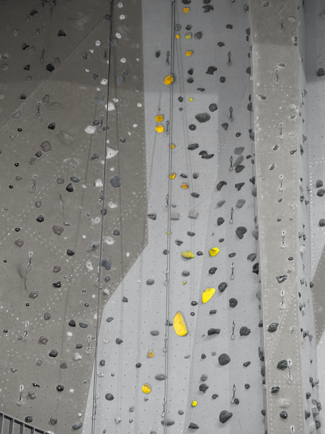
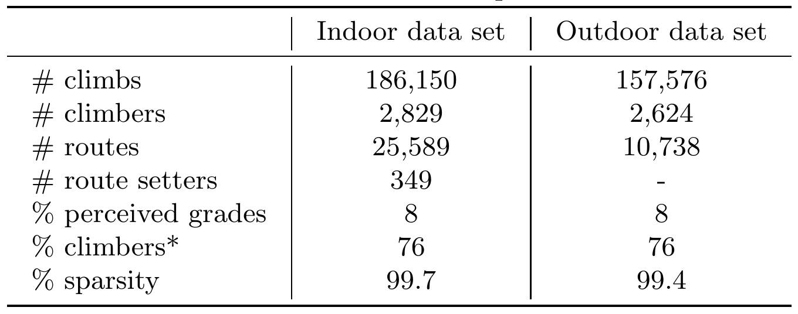
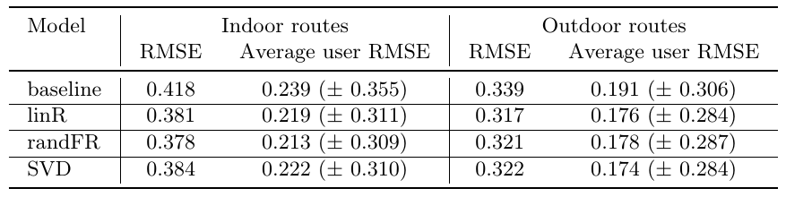

<!------>

## Climbing Route Difficulty Grade Prediction
It is well-known in the climbing community around the world that climbing routes are subjectively graded. A route setter or the climber who first ascended the route typically assigns the difficulty grade that is then shared with the rest of the community. The rater's levels of strenght and skill lead to a personal bias. Another climber, upon attempting the ascent, may find the route more difficulty or easier than officially stated. It is desirable to provide to each climber the route difficulty grade that reflects how this particular climber would perceived the difficulty of the route. 

Results of analysis of climbing ascents are discussed in the paper:
M.Andric, I.Ivanova, F.Ricci. Climbing Route Difficulty Grade Prediction with Explanation. 2021 IEEE/WIC/ACM International Joint Conference on Web Intelligence and Intelligent Agent Technology (WI-IAT). (to appear)
## Algorithms
There are two types of algorithms that were developed to predict the climber's perceived grade of route difficulty: 
> * Knowledge-based regressions models
> * Collaborative filtering 
## Contents and Usage
The perceived grade prediction algorithms are implemented in Python 3.7+. 
## Data
A database of ascents routes was obtained from the company Vertical-Life. Climbers can  register and record their ascents on indoor and outdoor routes through the [Vertical-Life app](https://www.vertical-life.info/). An ascent record include the identifier or the climber, the route, the route setter (for indoor ascents), date of ascent and the climber's perceived route difficulty grade. In about 8% of ascent records, the climber's grade is different from the official route grade. About 76% of climbers registered at least once a grade different from the official grade. The sparsity of climber-route matrices are 99.7% and 99.4% for indoor and outdoor ascents data sets respectively.

## Exploratory Analysis

<table><tr><td></td><td></td></tr></table>

## Features
## Evaluation

## Future Improvements

<!--## Supplemental Material
Results of analysis of climbing ascents are discussed in the paper:
M.Andric, I.Ivanova, F.Ricci. Climbing Route Difficulty Grade Prediction with Explanation. 2021 IEEE/WIC/ACM International Joint Conference on Web Intelligence and Intelligent Agent Technology (WI-IAT). (to appear)-->

## Credits
Special thanks to [Vertical-Life](https://www.vertical-life.info/) for providing the data and to Ben Lepesant and Andrea Janes for their time and expertise that greatly assisted this work.